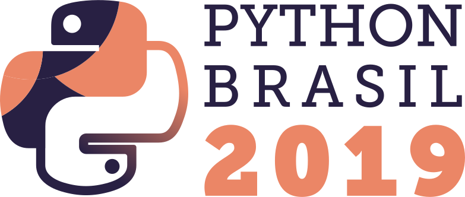

# Palestra: Serveless: zero to hero
Apresentada por: **Giana de Almeida Pereira**

A palestra **Serveless: zero to hero** foi apresentada no dia 25/10/2019, durante a [Conferência Python Brasil 2019](http://2019.pythonbrasil.org.br).

### Slides

Acesse os slides: **[Serveless: zero to hero](./pybr2019-giana-de-almeida-serveless-zero-to-hero.pdf)**

### Sobre Palestra
Uma visão prática desde conceitos base até o deploy ( - show me the code :DD). \nConheça a diferença das arquiteturas tradicionais (todas as funções em um lugar só) para as modulares (várias mini aplicações funcionando independentes).\nEntenda o conceito de serveless e o que são funções lambdas, acompanhe passo a passo como criar uma aplicação básica usando python e alguns dos principais recursos da cloud.\n\nStacks:\n- Amazon Web Services (AWS)\n- Python 3\n- O que é o AWS S3?\n- Usando AWS Lambda e API Gateway: usando um framework simples para gerar endpoints\n- Monitore seus logs com cloud watch\nBônus: Prevenção a cobranças! Aprenda como criar um alert na amazon para que você seja notificado caso passe do limite de requisições do modo gratuito.

### Minibio
De programadora de robôs a programadora de software, hoje está se especializando em backend.\nIntegration Enginner na empresa Leaf Agriculture, atua com arquiteturas de microservices e serveless na cloud.\nVoluntária na comunidade Python, acredita que conhecimento deve chegar a todos.\nPylady Floripa, viciada em miojo e apaixonada por gatos.

