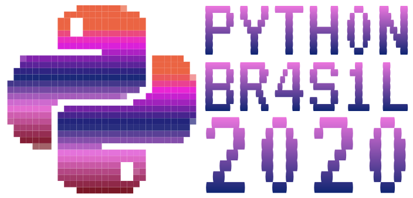

# Atividades ministradas na [Python Brasil 2020](http://2020.pythonbrasil.org.br)

Slides e materiais das Palestras apresentadas na Python Brasil 2020 entre os dias 2 e 6 de novembro de 2020, primeira edição do evento feito de maneira complemente online.

## Palestras

###  2 de novembro de 2020

<!-- seguir o exemplo a seguir para adicionar os links de uma nova talk:
- [**Aprendendo e ensinando Python para “programadores alternativos”**](./talks/aprendendo-e-ensinando-python-para/) - Alexandre Villares [slides](./talks/aprendendo-e-ensinando-python-para/pybr2019-alexandre-villares-aprendendo-e-ensinando-python-para.pdf)
--> 

- **Como você pode ajudar o Debian programando em Python** - Antonio Terceiro 

- **O Python e o Mercado de Trabalho** - Felipe Cabrera Ribeiro dos Santos

- **Protocolos: duck-typing estático FTW** - Luciano Ramalho

- **Uma Black Friday sem Catástrofes** - Jéssica Pauli de Castro Bonson

- **Como a programação mudou a minha vida - de médica a programadora** - Loyanne Repolho

- **Dados categóricos em árvore de decisão utilizando libs Python** - Ana Paula da Silva Mendes

- **Empoderamento Intergalático do Radioamadorismo utilizando Python** - Danilo de Nadai Sícari

- **Reconhecimento Facial em 5 passos** - Giovana Oliveira de Lucca

- **Colocando Modelos de Machine Learning em Produção com o Amazon Sagemaker** - Matheus Queiroz

- **Impulsionando sua carreira em tecnologia** - Leticia Portella

- **Open3D para Reconstrução 3D em Python** - Otavio Gomes

- **Uso de Python para ensino de POO em um curso de Graduação de Sistemas de Informação** - Tiago Bacciotti Moreira

- **Automatização da documentação traduzida do Python** - Rafael Ferreira Fontenelle

- **É Python isso?** - Henrique Gabriel Gularte Pereira

- **FoxDot: fazendo a pista dançar com Python** - Diego Moreira Guimarães

- **Reprodutibilidade e Produtização de Modelos Preditivos em Jupyter Notebook** - Victor Maricato

- **Empatia, ética, algoritmos e o futuro** - Carla Vieira

- **Entregando Infraestrutura Automatizada com Serverlesse Python** - William Lino Oliveira

- **WebScraping, Python e Ordem da Câmara dos Vereadores** - Gabriela Cavalcante da Silva

###  3 de novembro de 2020

- **Inovação e Tecnologia na educação: python como objeto de aprendizagem multidisciplinar** - Pâmella Araújo Balcaçar

- **Melhorando o desenvolvimento de Machine Learning utilizando MLFlow** - Andryw Marques Ramos

- **Qualidade vai além - Molecule** - Natalia Raythz

- **Tornando os Jupyter Notebooks mais legíveis para quem não é cientista de dados** - Artur Vieira de Sousa

- **Construindo chatbots com Rasa Framework** - Daniel Henrique da Silva

- **Estruturas de Dados Probabilísticas** - Artur Baruchi

- **Microsserviço: da ideia à nuvem** - Leonardo Larsen Rocha

- **Muito além de Bhaskara: Como utilizar Python para ensinar matemática** - Jerônimo Medina Madruga

- **FastAPI tão rápido quanto Node?** - Alexandre Fernandes dos Santos

- **Introdução à recuperação de informação musical** - Giovana Vieira de Morais

- **Micropython na Indústria** - Gustavo Voltani von Atzingen

- **Sub-Representação e Invisibilidade Feminina na STEM (Science, Technology, Engineering and Mathematics): uma análise de estereótipos, educação e plataformas de carreira** - Salete Silva Farias

- [**Ambientes Virtuais, o que são e para que servem?**](./talks/ambientes-virtuais-o-que-sao-e-para-que-servem/) - Maria Fernanda Souza Andrade [slides](./talks/ambientes-virtuais-o-que-sao-e-para-que-servem/ambiente-virtual-o-que-sao-e-para-que-servem.pdf)

- **Análise Numérica com Python: O Poder da Linguagem que Conquistou o Coração de Cientistas e Engenheiros** - Lis Ramos Barreto de Almeida

- **Ganhando performance no Python com Numba em projetos não científicos** - Alejandro Mesias André Nebra Perez

- **Mas não dá pra aprender tudo na internet? Entenda o por que fazer faculdade ainda vale a pena** - Igor dos Santos Montagner

- **Django como um detalhe de implementação** - Paulo Henrique Silva

- **Interface gráfica para seu script Python com Gtk e o Glade** - Michael de Mattos Ortiz

- **Python Aplicado ao Mercado Financeiro - Automação de Investimentos** - Pedro Lealdino Filho

### 4 de novembro de 2020

- **Construindo uma plataforma colaborativa de notícias com Python e código aberto** - Érico Andrei

- **Ensino de programação: Como fazer parte da comunidade global The Carpentries?** - Mariana Dias Guilardi e Beatriz Milz

- **Ensino Remoto Emergencial de Python** - Fernando Masanori

- **Utilizando Dataloaders para melhorar o desempenho das suas queries no GraphQL** - Rafael Capaci Pereira

- **Como a Hand Talk torna o mundo mais acessível utilizando Python?** - Joab Leite da Silva Neto

- **Human Learning: Por que ensinar e aprender Python?** - Mirlla Marques Santana Alves

- **Separando a lógica de extração da lógica de navegação com Scrapy** - Victor Paiva Torres

- **Usando RASA Boilerplate para criar um chatbot mais rápido que maratonar senhor dos anéis** - Bruna Nayara Moreira Lima

- **Design Patterns, Orientação a Objetos por Fora dos Frameworks** - João Sebastião de Oliveira Bueno

- **Essa documentação só falta falar - Escrevendo, revisando e testando (isso mesmo!) documentação para usuários finais** - Amanda Fonseca Savluchinske

- **Introdução a automação de processos robóticos com Python** - Ronald Rodrigues Farias

- **Tipos de tipos?** - Pablo Henrique Aguilar

- **Como submeter uma PEP pra comunidade : - Python** - Daniele Nazaré Tavares

- **Desmitificando pipeline de dados com python: o que aprendi em 6 anos.** - Robson Luis Monteiro Junior

- **O Python fofoqueiro: Utilizando Spacy e outras bibliotecas Python para ler conteúdos da Internet** - Rafael Calixto Ferreira de Araújo

- **Reconhecimento de texto e imagem com Python e CloudFunctions automatizando processos de TV :)** - Camilla Martins

- **Como encontrar o Wally utilizando Deep Learning e Python** - Arthur Fortes da Costa

- **Deep Learning com Python** - Carolina Fernanda da Silva

- **PyBR 2019: o impacto das comunidades na transição de carreira de uma mulher preta e a criação de novas perspectivas** - Allana Dabia Cardoso Teixeira de Paula

- **Querido Diário, hoje raspei dados usando... método científico?!** - Giulio Carvalho Cavalcante

### 5 de novembro de 2020

- **Associação Python Brasil (APyB)** - Patrick Mazulo e Gustavo Carvalho

- **Como e por que automatizar testes de integração da sua API? - ScanAPI** - Daniel Drumond Augusto

- **Iteração: A história secreta** - Naomi Ceder

- **Mercado de Trabalho em Dados - rotina de uma analista** - Patrícia do Nascimento

- **Transformação Digital da Ouvidoria na pandemia COVID-19** - Bruno Ferreira da Paixão

- **“Pensam que a gente é secretária”: trajetórias femininas em cursos técnicos de informática** - Vinicius Hartmann Ferreira

- **Como usamos IA para auxiliar médicos a lerem ECGs** - Jessica dos Santos de Oliveira

- **Criando Simetrias Pythônicas** - Bernardo Fontes

- **Observabilidade de sistemas distribuídos em Python** - Guilherme Vierno

- **Django, kubernetes e deadlocks - qual a solução ?** - Bruno Casella

- **O que acontece se juntar Spotify & Python & Data Science** - Luis Vinicius Lauriano de França

- **Renda, Python e Covid-19: como avaliar a experiência do cliente e gerar renda durante a pandemia** - Maria Fernanda Deveza Leitão

- **Uma proposta para introdução de programação no ensino de engenharias** - Fabíola Mariana Aguiar Ribeiro

- **Cara Gente Branca...da TI:** - Andreza Rocha

- **Desmistificando o git rebase** - André Luiz Girol

- **I know what you heard last summer: utilizando python para entender estilos musicais** - Juliany Raiol

- **Scrapy 101: raspando dados na web com Python** - Werberth Vinícius Souza Gomes

- **Como sobreviver a um time que fala um idioma que você não é fluente** - Ingrid Murielem Sebastiana

- **Débito Técnico: Porque isso vai estragar teu software** - Luan Fonseca de Farias

- **Dev, Ops!** - Lidiane de Souza Monteiro

- **The black box of the black boxes: Uma introdução a AutoML com Python** - José Estevam de Andrade Junior

- **Keynote** - Álvaro Justen (Turicas)

### 6 de novembro de 2020

- **Transmissão de conhecimento dentro da comunidade** - Patrícia Morimoto, Eduardo Mendes, Fabrícia Diniz e Fernando Masanori

- **Como Gerenciar Trocas de Contexto em tempo de Pandemia: Um Guia para melhorar a sua saúde mental no trabalho** - Nivaldo Gomes da Silva Filho

- **Construindo aplicações orientada a eventos utilizando serverless com Python** - Paula Grangeiro

- **Integração Continua com Python - Proposta de Stack** - Nilo Ney Coutinho Menezes

- **Lidando com sistemas legados** - Ricardo Cappellano

- **Detecção e Reconhecimento de Faces usando Python e DLib** - Lucas Grassano Lattari

- **O Uso da Análise do Comportamento para a Melhoria da Qualidade de Vida do Desenvolvedor Python.** - Nelson de Campos Nolasco

- **Processamento de Laudos Médicos usando BERT e Hugginface/Pytorch** - Walter Silva Martins Filho

- **Software educativo: o que é? como faz?** - Débora Karoline Silva de Azevedo

- **Análise de Dados e Forró - Dois amores, duas paixões** - Dandara Maria Costa de Sousa

- **Driblando Redes Neurais: uma introdução a ataques adversários** - David Pierre Alves

- **Ecossistemas de Colaboração: O que podemos dizer sobre as colaborações em redes sociais a partir da biologia?** - Guilherme Viegas de Faria

- **Utilizando Análise de Sentimentos para identificar comportamentos de consumo nas redes sociais** - Sarah Tuyani Araújo Soares

- **Keynote** - Ana Paula Gomes

### 7 de novembro de 2020

- **Criando um simples sistema de recomendação para e-commerce** - Cesar Augusto Bruschetta

- **Programação para seu projeto de Machine Learning** - Ricardo Manhães Savii

- **Criando seu próprio bot no telegram (do zero!) usando Flask** - Débora Atanes Buss

- **Desenhando e se divertindo com Python** - Alexandre B A Villares e Bernardo Fontes

- **Python e Load Balancer** - Natalia Raythz

- **Uma introdução ao Python Científico: NumPy, SciPy e Matplotlib** - Melissa Weber Mendonça

- **Criando Aplicações com Python e OpenCV 4** - Lucas Grassano Lattari

- **Desenvolvendo pyspark localmente com Docker** - Raissa Bergamini

- **Estrutura de Dados é ❤️** - Fernando Masanori

- **Mapas interativos para a agricultura em Python** - Nayane Jaqueline Costa Maia

### 8 de novembro de 2020

- **Criação de jogo retrô com Python e Pygame** - João Sebastião de Oliveira Bueno

- **ETL em python: trabalhando com dados abertos no mundo real** - Matheus Batista Silva

- **From zero to hero: Chegue sem saber nada de chatbot e faça um que fala mais que minha vó na fila da lotérica** - Bruna Nayara Moreira Lima

- **Machine Learning: a pythonic introduction** - André Luiz Figueiredo de Castro

- **Testes de Integração de APIs com Django** - Rafael Souza da Silva

- **Criando seu primeiro jogo com Python e PyGame** - João Paulo Carvalho

- **Criando uma aplicação de dados com Streamlit e deployando a mesma com Heroku** - Arthur Henrique Dell' Antonia

- **Redes Neurais com PyTorch** - Camila Laranjeira

- **Simplificando criar telas para desktop em tkinter com o PAGE** - Alejandro Mesias

- **Xarray, estruturas para dados multidimensionais** - Felipe Nornberg Schuch
